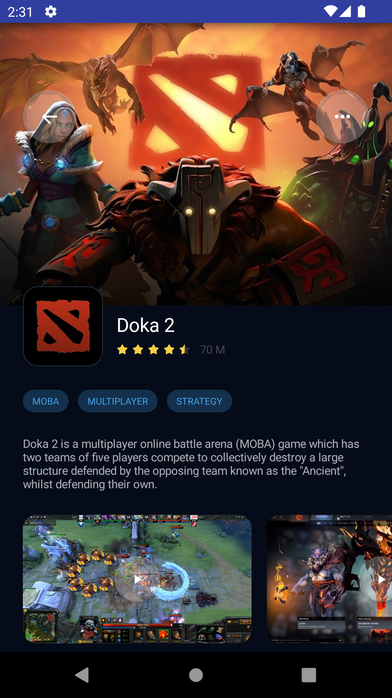

Homework for Podlodka Android Crew: Jetpack Compose

# Notes about architecture
In order to achieve reusability, the screen is divided into 'Cells'. Each 'Cell' has it's own UI, data Model and 
ViewModel. For example, here are base classes which corresponds to the yellow Button at the bottom of the screen:
- `ButtonCellModel` - data model for the Cell, contains title
- `ButtonCell` - UI for the cell
- `ButtonCellViewModel` - ViewModel for the Cell

